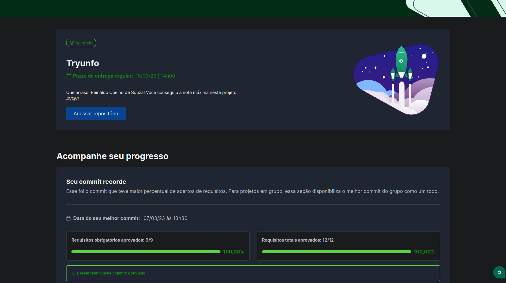

# 🎴 Tryunfo

## 📘 Sobre

Um jogo de cartas no estilo Super Trunfo com o tema Naruto.

## 🧩 Funcionalidades

- Criar novas cartas;
- Visualizar uma prévia;
- Adicioná-las ao deck;
- Visualizar as cartas do deck.

Acesse [aqui](https://coelhoreinaldo.github.io/tryunfo).

## ⚛️ Ferramentas

Projeto construído utilizando React.js.

- States;
- Props;
- Forms em React;
- Metodologia TDD (Test Driven Development).
- Mobile First;

## 🛠️ Como executar o projeto?

1. Instalando dependências

`npm install`

2. Executando a aplicação

`npm start`

## 📝 Nota

## ©️ Copyright

- Logo "Tryunfo" - Trybe.
- Todos os personagens da série de mangá e anime Naruto pertencem a editora Shueisha e ao escritor Masashi Kishimoto.
